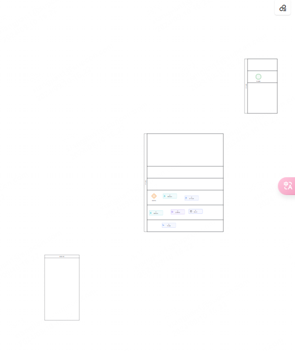

# React + Vite

This template provides a minimal setup to get React working in Vite with HMR and some ESLint rules.

Currently, two official plugins are available:

- [@vitejs/plugin-react](https://github.com/vitejs/vite-plugin-react/blob/main/packages/plugin-react/README.md) uses [Babel](https://babeljs.io/) for Fast Refresh
- [@vitejs/plugin-react-swc](https://github.com/vitejs/vite-plugin-react-swc) uses [SWC](https://swc.rs/) for Fast Refresh


## 图片



## bpmn转成json
```json
{
    "declaration": {
        "attributes": {
            "version": "1.0",
            "encoding": "UTF-8"
        }
    },
    "elements": [
        {
            "type": "element",
            "name": "definitions",
            "attributes": {
                "xmlns": "http://www.omg.org/spec/BPMN/20100524/MODEL",
                "xmlns:xsi": "http://www.w3.org/2001/XMLSchema-instance",
                "xmlns:bpmndi": "http://www.omg.org/spec/BPMN/20100524/DI",
                "xmlns:omgdc": "http://www.omg.org/spec/DD/20100524/DC",
                "xmlns:flowable": "http://flowable.org/bpmn",
                "xmlns:xsd": "http://www.w3.org/2001/XMLSchema",
                "targetNamespace": "http://flowable.org/bpmn"
            },
            "elements": [
                {
                    "type": "element",
                    "name": "collaboration",
                    "attributes": {
                        "id": "Collaboration_16t9fo4"
                    },
                    "elements": [
                        {
                            "type": "element",
                            "name": "participant",
                            "attributes": {
                                "id": "Participant_1iztgq2",
                                "name": "水平泳道",
                                "processRef": "Process_1ehnzp7"
                            }
                        },
                        {
                            "type": "element",
                            "name": "participant",
                            "attributes": {
                                "id": "Participant_17bjil3",
                                "name": "水平泳道",
                                "processRef": "Process_19ly067"
                            }
                        },
                        {
                            "type": "element",
                            "name": "participant",
                            "attributes": {
                                "id": "Participant_0g8vqae",
                                "name": "垂直泳道",
                                "processRef": "Process_1t2e62b"
                            }
                        }
                    ]
                },
                {
                    "type": "element",
                    "name": "process",
                    "attributes": {
                        "id": "Process_1ehnzp7"
                    },
                    "elements": [
                        {
                            "type": "element",
                            "name": "laneSet",
                            "attributes": {
                                "id": "LaneSet_1qvjgn4"
                            },
                            "elements": [
                                {
                                    "type": "element",
                                    "name": "lane",
                                    "attributes": {
                                        "id": "Lane_1b18ics"
                                    },
                                    "elements": [
                                        {
                                            "type": "element",
                                            "name": "flowNodeRef",
                                            "elements": [
                                                {
                                                    "type": "text",
                                                    "text": "Gateway_0rl9mff"
                                                }
                                            ]
                                        },
                                        {
                                            "type": "element",
                                            "name": "flowNodeRef",
                                            "elements": [
                                                {
                                                    "type": "text",
                                                    "text": "Activity_0ucieon"
                                                }
                                            ]
                                        },
                                        {
                                            "type": "element",
                                            "name": "flowNodeRef",
                                            "elements": [
                                                {
                                                    "type": "text",
                                                    "text": "Activity_1ll7kia"
                                                }
                                            ]
                                        }
                                    ]
                                },
                                {
                                    "type": "element",
                                    "name": "lane",
                                    "attributes": {
                                        "id": "Lane_04tw2iz"
                                    },
                                    "elements": [
                                        {
                                            "type": "element",
                                            "name": "flowNodeRef",
                                            "elements": [
                                                {
                                                    "type": "text",
                                                    "text": "Activity_0xs5xhk"
                                                }
                                            ]
                                        },
                                        {
                                            "type": "element",
                                            "name": "flowNodeRef",
                                            "elements": [
                                                {
                                                    "type": "text",
                                                    "text": "Activity_0961sye"
                                                }
                                            ]
                                        },
                                        {
                                            "type": "element",
                                            "name": "flowNodeRef",
                                            "elements": [
                                                {
                                                    "type": "text",
                                                    "text": "Activity_1rtw9w2"
                                                }
                                            ]
                                        }
                                    ]
                                },
                                {
                                    "type": "element",
                                    "name": "lane",
                                    "attributes": {
                                        "id": "Lane_0v8erp5"
                                    },
                                    "elements": [
                                        {
                                            "type": "element",
                                            "name": "flowNodeRef",
                                            "elements": [
                                                {
                                                    "type": "text",
                                                    "text": "Activity_17fk0f6"
                                                }
                                            ]
                                        }
                                    ]
                                },
                                {
                                    "type": "element",
                                    "name": "lane",
                                    "attributes": {
                                        "id": "Lane_027h5rf"
                                    },
                                    "elements": [
                                        {
                                            "type": "element",
                                            "name": "childLaneSet",
                                            "attributes": {
                                                "id": "LaneSet_101766a"
                                            }
                                        }
                                    ]
                                }
                            ]
                        },
                        {
                            "type": "element",
                            "name": "inclusiveGateway",
                            "attributes": {
                                "id": "Gateway_0rl9mff",
                                "name": "相容网关"
                            }
                        },
                        {
                            "type": "element",
                            "name": "task",
                            "attributes": {
                                "id": "Activity_0xs5xhk",
                                "name": "05\n应用系统",
                                "isApplication": "ApplicationSystem"
                            }
                        },
                        {
                            "type": "element",
                            "name": "callActivity",
                            "attributes": {
                                "id": "Activity_0ucieon",
                                "name": "10\n调用活动"
                            }
                        },
                        {
                            "type": "element",
                            "name": "task",
                            "attributes": {
                                "id": "Activity_1ll7kia",
                                "name": "15\n线下任务"
                            }
                        },
                        {
                            "type": "element",
                            "name": "callActivity",
                            "attributes": {
                                "id": "Activity_0961sye",
                                "name": "25\n调用活动"
                            }
                        },
                        {
                            "type": "element",
                            "name": "subProcess",
                            "attributes": {
                                "id": "Activity_1rtw9w2",
                                "name": "20\n审批流",
                                "isEdit": "0"
                            },
                            "elements": [
                                {
                                    "type": "element",
                                    "name": "startEvent",
                                    "attributes": {
                                        "id": "Event_0508nvp",
                                        "name": "开始事件",
                                        "flowable:parent": "subProcess"
                                    }
                                }
                            ]
                        },
                        {
                            "type": "element",
                            "name": "subProcess",
                            "attributes": {
                                "id": "Activity_17fk0f6",
                                "name": "30\n子流程"
                            }
                        }
                    ]
                },
                {
                    "type": "element",
                    "name": "process",
                    "attributes": {
                        "id": "Process_19ly067"
                    },
                    "elements": [
                        {
                            "type": "element",
                            "name": "laneSet",
                            "attributes": {
                                "id": "LaneSet_0t1bsvf"
                            },
                            "elements": [
                                {
                                    "type": "element",
                                    "name": "lane",
                                    "attributes": {
                                        "id": "Lane_1l0agae"
                                    }
                                },
                                {
                                    "type": "element",
                                    "name": "lane",
                                    "attributes": {
                                        "id": "Lane_0fq7q5h"
                                    }
                                },
                                {
                                    "type": "element",
                                    "name": "lane",
                                    "attributes": {
                                        "id": "Lane_0nvxd6r"
                                    }
                                },
                                {
                                    "type": "element",
                                    "name": "lane",
                                    "attributes": {
                                        "id": "Lane_0yunmlh"
                                    },
                                    "elements": [
                                        {
                                            "type": "element",
                                            "name": "flowNodeRef",
                                            "elements": [
                                                {
                                                    "type": "text",
                                                    "text": "Gateway_09wcvar"
                                                }
                                            ]
                                        }
                                    ]
                                },
                                {
                                    "type": "element",
                                    "name": "lane",
                                    "attributes": {
                                        "id": "Lane_04c44r5"
                                    }
                                },
                                {
                                    "type": "element",
                                    "name": "lane",
                                    "attributes": {
                                        "id": "Lane_17qdx62"
                                    }
                                },
                                {
                                    "type": "element",
                                    "name": "lane",
                                    "attributes": {
                                        "id": "Lane_1xhroas"
                                    }
                                },
                                {
                                    "type": "element",
                                    "name": "lane",
                                    "attributes": {
                                        "id": "Lane_0vxm8p6"
                                    }
                                },
                                {
                                    "type": "element",
                                    "name": "lane",
                                    "attributes": {
                                        "id": "Lane_1rylgw4"
                                    }
                                },
                                {
                                    "type": "element",
                                    "name": "lane",
                                    "attributes": {
                                        "id": "Lane_1jggbix"
                                    }
                                },
                                {
                                    "type": "element",
                                    "name": "lane",
                                    "attributes": {
                                        "id": "Lane_0rvf54t"
                                    }
                                },
                                {
                                    "type": "element",
                                    "name": "lane",
                                    "attributes": {
                                        "id": "Lane_0g4dhum"
                                    }
                                },
                                {
                                    "type": "element",
                                    "name": "lane",
                                    "attributes": {
                                        "id": "Lane_07m3yk4"
                                    }
                                },
                                {
                                    "type": "element",
                                    "name": "lane",
                                    "attributes": {
                                        "id": "Lane_1f6urht",
                                        "name": ""
                                    },
                                    "elements": [
                                        {
                                            "type": "element",
                                            "name": "flowNodeRef",
                                            "elements": [
                                                {
                                                    "type": "text",
                                                    "text": "Activity_1iufm1e"
                                                }
                                            ]
                                        },
                                        {
                                            "type": "element",
                                            "name": "childLaneSet",
                                            "attributes": {
                                                "id": "LaneSet_1kfk02t"
                                            }
                                        }
                                    ]
                                },
                                {
                                    "type": "element",
                                    "name": "lane",
                                    "attributes": {
                                        "id": "Lane_0rnoeal"
                                    },
                                    "elements": [
                                        {
                                            "type": "element",
                                            "name": "childLaneSet",
                                            "attributes": {
                                                "id": "LaneSet_0riu2my"
                                            }
                                        }
                                    ]
                                },
                                {
                                    "type": "element",
                                    "name": "lane",
                                    "attributes": {
                                        "id": "Lane_1v40qzi"
                                    }
                                },
                                {
                                    "type": "element",
                                    "name": "lane",
                                    "attributes": {
                                        "id": "Lane_1gvsgad"
                                    }
                                },
                                {
                                    "type": "element",
                                    "name": "lane",
                                    "attributes": {
                                        "id": "Lane_095igvy"
                                    }
                                },
                                {
                                    "type": "element",
                                    "name": "lane",
                                    "attributes": {
                                        "id": "Lane_1c7ghrp"
                                    }
                                },
                                {
                                    "type": "element",
                                    "name": "lane",
                                    "attributes": {
                                        "id": "Lane_0ydvo8q"
                                    }
                                }
                            ]
                        },
                        {
                            "type": "element",
                            "name": "serviceTask",
                            "attributes": {
                                "id": "Activity_1iufm1e",
                                "name": "35\n服务任务"
                            }
                        },
                        {
                            "type": "element",
                            "name": "exclusiveGateway",
                            "attributes": {
                                "id": "Gateway_09wcvar",
                                "name": "排他网关"
                            }
                        }
                    ]
                },
                {
                    "type": "element",
                    "name": "process",
                    "attributes": {
                        "id": "Process_1t2e62b"
                    }
                },
                {
                    "type": "element",
                    "name": "bpmndi:BPMNDiagram",
                    "attributes": {
                        "id": "BPMNDiagram_1"
                    },
                    "elements": [
                        {
                            "type": "element",
                            "name": "bpmndi:BPMNPlane",
                            "attributes": {
                                "id": "BPMNPlane_1",
                                "bpmnElement": "Collaboration_16t9fo4"
                            },
                            "elements": [
                                {
                                    "type": "element",
                                    "name": "bpmndi:BPMNShape",
                                    "attributes": {
                                        "id": "Participant_1iztgq2_di",
                                        "bpmnElement": "Participant_1iztgq2",
                                        "isHorizontal": "true"
                                    },
                                    "elements": [
                                        {
                                            "type": "element",
                                            "name": "omgdc:Bounds",
                                            "attributes": {
                                                "x": "205",
                                                "y": "-85",
                                                "width": "800",
                                                "height": "750"
                                            }
                                        },
                                        {
                                            "type": "element",
                                            "name": "bpmndi:BPMNLabel"
                                        }
                                    ]
                                },
                                {
                                    "type": "element",
                                    "name": "bpmndi:BPMNShape",
                                    "attributes": {
                                        "id": "Lane_027h5rf_di",
                                        "bpmnElement": "Lane_027h5rf",
                                        "isHorizontal": "true"
                                    },
                                    "elements": [
                                        {
                                            "type": "element",
                                            "name": "omgdc:Bounds",
                                            "attributes": {
                                                "x": "235",
                                                "y": "-85",
                                                "width": "770",
                                                "height": "330"
                                            }
                                        }
                                    ]
                                },
                                {
                                    "type": "element",
                                    "name": "bpmndi:BPMNShape",
                                    "attributes": {
                                        "id": "Lane_0v8erp5_di",
                                        "bpmnElement": "Lane_0v8erp5",
                                        "isHorizontal": "true"
                                    },
                                    "elements": [
                                        {
                                            "type": "element",
                                            "name": "omgdc:Bounds",
                                            "attributes": {
                                                "x": "235",
                                                "y": "545",
                                                "width": "770",
                                                "height": "120"
                                            }
                                        }
                                    ]
                                },
                                {
                                    "type": "element",
                                    "name": "bpmndi:BPMNShape",
                                    "attributes": {
                                        "id": "Lane_04tw2iz_di",
                                        "bpmnElement": "Lane_04tw2iz",
                                        "isHorizontal": "true"
                                    },
                                    "elements": [
                                        {
                                            "type": "element",
                                            "name": "omgdc:Bounds",
                                            "attributes": {
                                                "x": "235",
                                                "y": "395",
                                                "width": "770",
                                                "height": "150"
                                            }
                                        }
                                    ]
                                },
                                {
                                    "type": "element",
                                    "name": "bpmndi:BPMNShape",
                                    "attributes": {
                                        "id": "Lane_1b18ics_di",
                                        "bpmnElement": "Lane_1b18ics",
                                        "isHorizontal": "true"
                                    },
                                    "elements": [
                                        {
                                            "type": "element",
                                            "name": "omgdc:Bounds",
                                            "attributes": {
                                                "x": "235",
                                                "y": "245",
                                                "width": "770",
                                                "height": "150"
                                            }
                                        }
                                    ]
                                },
                                {
                                    "type": "element",
                                    "name": "bpmndi:BPMNShape",
                                    "attributes": {
                                        "id": "Gateway_0rl9mff_di",
                                        "bpmnElement": "Gateway_0rl9mff"
                                    },
                                    "elements": [
                                        {
                                            "type": "element",
                                            "name": "omgdc:Bounds",
                                            "attributes": {
                                                "x": "273",
                                                "y": "273",
                                                "width": "64",
                                                "height": "64"
                                            }
                                        },
                                        {
                                            "type": "element",
                                            "name": "bpmndi:BPMNLabel",
                                            "elements": [
                                                {
                                                    "type": "element",
                                                    "name": "omgdc:Bounds",
                                                    "attributes": {
                                                        "x": "283",
                                                        "y": "344",
                                                        "width": "44",
                                                        "height": "14"
                                                    }
                                                }
                                            ]
                                        }
                                    ]
                                },
                                {
                                    "type": "element",
                                    "name": "bpmndi:BPMNShape",
                                    "attributes": {
                                        "id": "Activity_0xs5xhk_di",
                                        "bpmnElement": "Activity_0xs5xhk"
                                    },
                                    "elements": [
                                        {
                                            "type": "element",
                                            "name": "omgdc:Bounds",
                                            "attributes": {
                                                "x": "475",
                                                "y": "441",
                                                "width": "140",
                                                "height": "48"
                                            }
                                        },
                                        {
                                            "type": "element",
                                            "name": "bpmndi:BPMNLabel"
                                        }
                                    ]
                                },
                                {
                                    "type": "element",
                                    "name": "bpmndi:BPMNShape",
                                    "attributes": {
                                        "id": "Activity_0ucieon_di",
                                        "bpmnElement": "Activity_0ucieon"
                                    },
                                    "elements": [
                                        {
                                            "type": "element",
                                            "name": "omgdc:Bounds",
                                            "attributes": {
                                                "x": "395",
                                                "y": "281",
                                                "width": "140",
                                                "height": "48"
                                            }
                                        },
                                        {
                                            "type": "element",
                                            "name": "bpmndi:BPMNLabel"
                                        }
                                    ]
                                },
                                {
                                    "type": "element",
                                    "name": "bpmndi:BPMNShape",
                                    "attributes": {
                                        "id": "Activity_1ll7kia_di",
                                        "bpmnElement": "Activity_1ll7kia"
                                    },
                                    "elements": [
                                        {
                                            "type": "element",
                                            "name": "omgdc:Bounds",
                                            "attributes": {
                                                "x": "615",
                                                "y": "301",
                                                "width": "140",
                                                "height": "48"
                                            }
                                        },
                                        {
                                            "type": "element",
                                            "name": "bpmndi:BPMNLabel"
                                        }
                                    ]
                                },
                                {
                                    "type": "element",
                                    "name": "bpmndi:BPMNShape",
                                    "attributes": {
                                        "id": "Activity_0961sye_di",
                                        "bpmnElement": "Activity_0961sye"
                                    },
                                    "elements": [
                                        {
                                            "type": "element",
                                            "name": "omgdc:Bounds",
                                            "attributes": {
                                                "x": "255",
                                                "y": "451",
                                                "width": "140",
                                                "height": "48"
                                            }
                                        },
                                        {
                                            "type": "element",
                                            "name": "bpmndi:BPMNLabel"
                                        }
                                    ]
                                },
                                {
                                    "type": "element",
                                    "name": "bpmndi:BPMNShape",
                                    "attributes": {
                                        "id": "Activity_1rtw9w2_di",
                                        "bpmnElement": "Activity_1rtw9w2",
                                        "isExpanded": "false"
                                    },
                                    "elements": [
                                        {
                                            "type": "element",
                                            "name": "omgdc:Bounds",
                                            "attributes": {
                                                "x": "655",
                                                "y": "436",
                                                "width": "140",
                                                "height": "48"
                                            }
                                        },
                                        {
                                            "type": "element",
                                            "name": "bpmndi:BPMNLabel"
                                        }
                                    ]
                                },
                                {
                                    "type": "element",
                                    "name": "bpmndi:BPMNShape",
                                    "attributes": {
                                        "id": "Activity_17fk0f6_di",
                                        "bpmnElement": "Activity_17fk0f6"
                                    },
                                    "elements": [
                                        {
                                            "type": "element",
                                            "name": "omgdc:Bounds",
                                            "attributes": {
                                                "x": "385",
                                                "y": "575",
                                                "width": "140",
                                                "height": "48"
                                            }
                                        },
                                        {
                                            "type": "element",
                                            "name": "bpmndi:BPMNLabel"
                                        }
                                    ]
                                },
                                {
                                    "type": "element",
                                    "name": "bpmndi:BPMNShape",
                                    "attributes": {
                                        "id": "Participant_17bjil3_di",
                                        "bpmnElement": "Participant_17bjil3",
                                        "isHorizontal": "true"
                                    },
                                    "elements": [
                                        {
                                            "type": "element",
                                            "name": "omgdc:Bounds",
                                            "attributes": {
                                                "x": "-930",
                                                "y": "-2430",
                                                "width": "3580",
                                                "height": "2700"
                                            }
                                        },
                                        {
                                            "type": "element",
                                            "name": "bpmndi:BPMNLabel"
                                        }
                                    ]
                                },
                                {
                                    "type": "element",
                                    "name": "bpmndi:BPMNShape",
                                    "attributes": {
                                        "id": "Lane_0ydvo8q_di",
                                        "bpmnElement": "Lane_0ydvo8q",
                                        "isHorizontal": "true"
                                    },
                                    "elements": [
                                        {
                                            "type": "element",
                                            "name": "omgdc:Bounds",
                                            "attributes": {
                                                "x": "-900",
                                                "y": "-450",
                                                "width": "3550",
                                                "height": "240"
                                            }
                                        }
                                    ]
                                },
                                {
                                    "type": "element",
                                    "name": "bpmndi:BPMNShape",
                                    "attributes": {
                                        "id": "Lane_1c7ghrp_di",
                                        "bpmnElement": "Lane_1c7ghrp",
                                        "isHorizontal": "true"
                                    },
                                    "elements": [
                                        {
                                            "type": "element",
                                            "name": "omgdc:Bounds",
                                            "attributes": {
                                                "x": "-900",
                                                "y": "-1470",
                                                "width": "3550",
                                                "height": "140"
                                            }
                                        }
                                    ]
                                },
                                {
                                    "type": "element",
                                    "name": "bpmndi:BPMNShape",
                                    "attributes": {
                                        "id": "Lane_095igvy_di",
                                        "bpmnElement": "Lane_095igvy",
                                        "isHorizontal": "true"
                                    },
                                    "elements": [
                                        {
                                            "type": "element",
                                            "name": "omgdc:Bounds",
                                            "attributes": {
                                                "x": "-900",
                                                "y": "-1330",
                                                "width": "3550",
                                                "height": "100"
                                            }
                                        }
                                    ]
                                },
                                {
                                    "type": "element",
                                    "name": "bpmndi:BPMNShape",
                                    "attributes": {
                                        "id": "Lane_1gvsgad_di",
                                        "bpmnElement": "Lane_1gvsgad",
                                        "isHorizontal": "true"
                                    },
                                    "elements": [
                                        {
                                            "type": "element",
                                            "name": "omgdc:Bounds",
                                            "attributes": {
                                                "x": "-900",
                                                "y": "-630",
                                                "width": "3550",
                                                "height": "60"
                                            }
                                        }
                                    ]
                                },
                                {
                                    "type": "element",
                                    "name": "bpmndi:BPMNShape",
                                    "attributes": {
                                        "id": "Lane_1v40qzi_di",
                                        "bpmnElement": "Lane_1v40qzi",
                                        "isHorizontal": "true"
                                    },
                                    "elements": [
                                        {
                                            "type": "element",
                                            "name": "omgdc:Bounds",
                                            "attributes": {
                                                "x": "-900",
                                                "y": "-750",
                                                "width": "3550",
                                                "height": "120"
                                            }
                                        }
                                    ]
                                },
                                {
                                    "type": "element",
                                    "name": "bpmndi:BPMNShape",
                                    "attributes": {
                                        "id": "Lane_0rnoeal_di",
                                        "bpmnElement": "Lane_0rnoeal",
                                        "isHorizontal": "true"
                                    },
                                    "elements": [
                                        {
                                            "type": "element",
                                            "name": "omgdc:Bounds",
                                            "attributes": {
                                                "x": "-900",
                                                "y": "-870",
                                                "width": "3550",
                                                "height": "120"
                                            }
                                        }
                                    ]
                                },
                                {
                                    "type": "element",
                                    "name": "bpmndi:BPMNShape",
                                    "attributes": {
                                        "id": "Lane_1f6urht_di",
                                        "bpmnElement": "Lane_1f6urht",
                                        "isHorizontal": "true"
                                    },
                                    "elements": [
                                        {
                                            "type": "element",
                                            "name": "omgdc:Bounds",
                                            "attributes": {
                                                "x": "-900",
                                                "y": "-990",
                                                "width": "3550",
                                                "height": "120"
                                            }
                                        }
                                    ]
                                },
                                {
                                    "type": "element",
                                    "name": "bpmndi:BPMNShape",
                                    "attributes": {
                                        "id": "Lane_07m3yk4_di",
                                        "bpmnElement": "Lane_07m3yk4",
                                        "isHorizontal": "true"
                                    },
                                    "elements": [
                                        {
                                            "type": "element",
                                            "name": "omgdc:Bounds",
                                            "attributes": {
                                                "x": "-900",
                                                "y": "-1110",
                                                "width": "3550",
                                                "height": "120"
                                            }
                                        }
                                    ]
                                },
                                {
                                    "type": "element",
                                    "name": "bpmndi:BPMNShape",
                                    "attributes": {
                                        "id": "Lane_0g4dhum_di",
                                        "bpmnElement": "Lane_0g4dhum",
                                        "isHorizontal": "true"
                                    },
                                    "elements": [
                                        {
                                            "type": "element",
                                            "name": "omgdc:Bounds",
                                            "attributes": {
                                                "x": "-900",
                                                "y": "-1230",
                                                "width": "3550",
                                                "height": "120"
                                            }
                                        }
                                    ]
                                },
                                {
                                    "type": "element",
                                    "name": "bpmndi:BPMNShape",
                                    "attributes": {
                                        "id": "Lane_0rvf54t_di",
                                        "bpmnElement": "Lane_0rvf54t",
                                        "isHorizontal": "true"
                                    },
                                    "elements": [
                                        {
                                            "type": "element",
                                            "name": "omgdc:Bounds",
                                            "attributes": {
                                                "x": "-900",
                                                "y": "-1720",
                                                "width": "3550",
                                                "height": "120"
                                            }
                                        }
                                    ]
                                },
                                {
                                    "type": "element",
                                    "name": "bpmndi:BPMNShape",
                                    "attributes": {
                                        "id": "Lane_1jggbix_di",
                                        "bpmnElement": "Lane_1jggbix",
                                        "isHorizontal": "true"
                                    },
                                    "elements": [
                                        {
                                            "type": "element",
                                            "name": "omgdc:Bounds",
                                            "attributes": {
                                                "x": "-900",
                                                "y": "-1900",
                                                "width": "3550",
                                                "height": "180"
                                            }
                                        }
                                    ]
                                },
                                {
                                    "type": "element",
                                    "name": "bpmndi:BPMNShape",
                                    "attributes": {
                                        "id": "Lane_1rylgw4_di",
                                        "bpmnElement": "Lane_1rylgw4",
                                        "isHorizontal": "true"
                                    },
                                    "elements": [
                                        {
                                            "type": "element",
                                            "name": "omgdc:Bounds",
                                            "attributes": {
                                                "x": "-900",
                                                "y": "-2310",
                                                "width": "3550",
                                                "height": "250"
                                            }
                                        }
                                    ]
                                },
                                {
                                    "type": "element",
                                    "name": "bpmndi:BPMNShape",
                                    "attributes": {
                                        "id": "Lane_0vxm8p6_di",
                                        "bpmnElement": "Lane_0vxm8p6",
                                        "isHorizontal": "true"
                                    },
                                    "elements": [
                                        {
                                            "type": "element",
                                            "name": "omgdc:Bounds",
                                            "attributes": {
                                                "x": "-900",
                                                "y": "-2060",
                                                "width": "3550",
                                                "height": "160"
                                            }
                                        }
                                    ]
                                },
                                {
                                    "type": "element",
                                    "name": "bpmndi:BPMNShape",
                                    "attributes": {
                                        "id": "Lane_1xhroas_di",
                                        "bpmnElement": "Lane_1xhroas",
                                        "isHorizontal": "true"
                                    },
                                    "elements": [
                                        {
                                            "type": "element",
                                            "name": "omgdc:Bounds",
                                            "attributes": {
                                                "x": "-900",
                                                "y": "-1600",
                                                "width": "3550",
                                                "height": "130"
                                            }
                                        }
                                    ]
                                },
                                {
                                    "type": "element",
                                    "name": "bpmndi:BPMNShape",
                                    "attributes": {
                                        "id": "Lane_17qdx62_di",
                                        "bpmnElement": "Lane_17qdx62",
                                        "isHorizontal": "true"
                                    },
                                    "elements": [
                                        {
                                            "type": "element",
                                            "name": "omgdc:Bounds",
                                            "attributes": {
                                                "x": "-900",
                                                "y": "-570",
                                                "width": "3550",
                                                "height": "120"
                                            }
                                        }
                                    ]
                                },
                                {
                                    "type": "element",
                                    "name": "bpmndi:BPMNShape",
                                    "attributes": {
                                        "id": "Lane_04c44r5_di",
                                        "bpmnElement": "Lane_04c44r5",
                                        "isHorizontal": "true"
                                    },
                                    "elements": [
                                        {
                                            "type": "element",
                                            "name": "omgdc:Bounds",
                                            "attributes": {
                                                "x": "-900",
                                                "y": "90",
                                                "width": "3550",
                                                "height": "60"
                                            }
                                        }
                                    ]
                                },
                                {
                                    "type": "element",
                                    "name": "bpmndi:BPMNShape",
                                    "attributes": {
                                        "id": "Lane_0yunmlh_di",
                                        "bpmnElement": "Lane_0yunmlh",
                                        "isHorizontal": "true"
                                    },
                                    "elements": [
                                        {
                                            "type": "element",
                                            "name": "omgdc:Bounds",
                                            "attributes": {
                                                "x": "-900",
                                                "y": "-210",
                                                "width": "3550",
                                                "height": "300"
                                            }
                                        }
                                    ]
                                },
                                {
                                    "type": "element",
                                    "name": "bpmndi:BPMNShape",
                                    "attributes": {
                                        "id": "Lane_0nvxd6r_di",
                                        "bpmnElement": "Lane_0nvxd6r",
                                        "isHorizontal": "true"
                                    },
                                    "elements": [
                                        {
                                            "type": "element",
                                            "name": "omgdc:Bounds",
                                            "attributes": {
                                                "x": "-900",
                                                "y": "-2370",
                                                "width": "3550",
                                                "height": "60"
                                            }
                                        }
                                    ]
                                },
                                {
                                    "type": "element",
                                    "name": "bpmndi:BPMNShape",
                                    "attributes": {
                                        "id": "Lane_0fq7q5h_di",
                                        "bpmnElement": "Lane_0fq7q5h",
                                        "isHorizontal": "true"
                                    },
                                    "elements": [
                                        {
                                            "type": "element",
                                            "name": "omgdc:Bounds",
                                            "attributes": {
                                                "x": "-900",
                                                "y": "150",
                                                "width": "3550",
                                                "height": "120"
                                            }
                                        }
                                    ]
                                },
                                {
                                    "type": "element",
                                    "name": "bpmndi:BPMNShape",
                                    "attributes": {
                                        "id": "Lane_1l0agae_di",
                                        "bpmnElement": "Lane_1l0agae",
                                        "isHorizontal": "true"
                                    },
                                    "elements": [
                                        {
                                            "type": "element",
                                            "name": "omgdc:Bounds",
                                            "attributes": {
                                                "x": "-900",
                                                "y": "-2430",
                                                "width": "3550",
                                                "height": "60"
                                            }
                                        }
                                    ]
                                },
                                {
                                    "type": "element",
                                    "name": "bpmndi:BPMNShape",
                                    "attributes": {
                                        "id": "Activity_1iufm1e_di",
                                        "bpmnElement": "Activity_1iufm1e"
                                    },
                                    "elements": [
                                        {
                                            "type": "element",
                                            "name": "omgdc:Bounds",
                                            "attributes": {
                                                "x": "-331",
                                                "y": "-969",
                                                "width": "132",
                                                "height": "77"
                                            }
                                        },
                                        {
                                            "type": "element",
                                            "name": "bpmndi:BPMNLabel"
                                        }
                                    ]
                                },
                                {
                                    "type": "element",
                                    "name": "bpmndi:BPMNShape",
                                    "attributes": {
                                        "id": "Gateway_09wcvar_di",
                                        "bpmnElement": "Gateway_09wcvar",
                                        "isMarkerVisible": "true"
                                    },
                                    "elements": [
                                        {
                                            "type": "element",
                                            "name": "omgdc:Bounds",
                                            "attributes": {
                                                "x": "798",
                                                "y": "-122",
                                                "width": "64",
                                                "height": "184"
                                            }
                                        },
                                        {
                                            "type": "element",
                                            "name": "bpmndi:BPMNLabel",
                                            "elements": [
                                                {
                                                    "type": "element",
                                                    "name": "omgdc:Bounds",
                                                    "attributes": {
                                                        "x": "763",
                                                        "y": "-147",
                                                        "width": "44",
                                                        "height": "14"
                                                    }
                                                }
                                            ]
                                        }
                                    ]
                                },
                                {
                                    "type": "element",
                                    "name": "bpmndi:BPMNShape",
                                    "attributes": {
                                        "id": "Participant_0g8vqae_di",
                                        "bpmnElement": "Participant_0g8vqae",
                                        "isHorizontal": "false"
                                    },
                                    "elements": [
                                        {
                                            "type": "element",
                                            "name": "omgdc:Bounds",
                                            "attributes": {
                                                "x": "-800",
                                                "y": "900",
                                                "width": "350",
                                                "height": "660"
                                            }
                                        }
                                    ]
                                }
                            ]
                        }
                    ]
                },
                {
                    "type": "element",
                    "name": "bpmndi:BPMNDiagram",
                    "attributes": {
                        "id": "BPMNDiagram_1cflz0d"
                    },
                    "elements": [
                        {
                            "type": "element",
                            "name": "bpmndi:BPMNPlane",
                            "attributes": {
                                "id": "BPMNPlane_05dcnzm",
                                "bpmnElement": "Activity_17fk0f6"
                            }
                        }
                    ]
                },
                {
                    "type": "element",
                    "name": "bpmndi:BPMNDiagram",
                    "attributes": {
                        "id": "BPMNDiagram_0qorj5n"
                    },
                    "elements": [
                        {
                            "type": "element",
                            "name": "bpmndi:BPMNPlane",
                            "attributes": {
                                "id": "BPMNPlane_0zoz18a",
                                "bpmnElement": "Activity_1rtw9w2"
                            },
                            "elements": [
                                {
                                    "type": "element",
                                    "name": "bpmndi:BPMNShape",
                                    "attributes": {
                                        "id": "Event_0508nvp_di",
                                        "bpmnElement": "Event_0508nvp"
                                    },
                                    "elements": [
                                        {
                                            "type": "element",
                                            "name": "omgdc:Bounds",
                                            "attributes": {
                                                "x": "180",
                                                "y": "160",
                                                "width": "64",
                                                "height": "64"
                                            }
                                        },
                                        {
                                            "type": "element",
                                            "name": "bpmndi:BPMNLabel",
                                            "elements": [
                                                {
                                                    "type": "element",
                                                    "name": "omgdc:Bounds",
                                                    "attributes": {
                                                        "x": "190",
                                                        "y": "231",
                                                        "width": "44",
                                                        "height": "14"
                                                    }
                                                }
                                            ]
                                        }
                                    ]
                                }
                            ]
                        }
                    ]
                }
            ]
        }
    ]
}
```